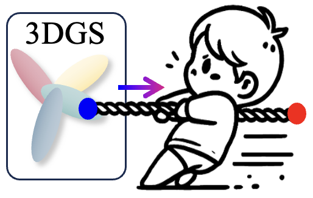

  

<!--   <h1 align="center"></h1> -->
  <h1 align="center"> Drag-Your-Gaussian</h1>
  

        
        
  

  
Officially implement of the paper "Drag Your Gaussian: Effective Drag-Based Editing with Score Distillation for 3D Gaussian Splatting".

**😊 TL;DR**

DYG allows users to drag 3D Gaussians, achieving flexible and precise 3D scene editing results.

## 🎥 Introduction Video

<!-- 

  

 -->

https://github.com/user-attachments/assets/1e484ff9-f44c-4995-a99d-453cf0f11f95

Visiting our [**Project Page**](https://quyans.github.io/Drag-Your-Gaussian/) for more result.
