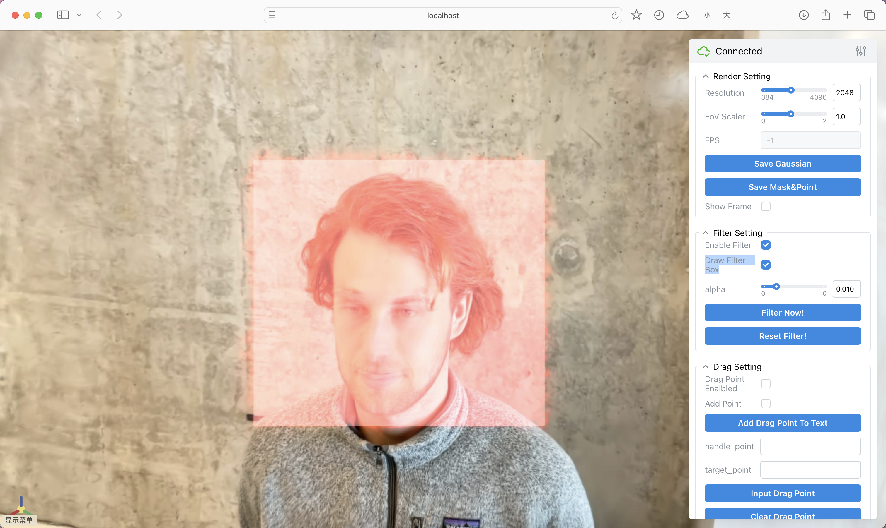
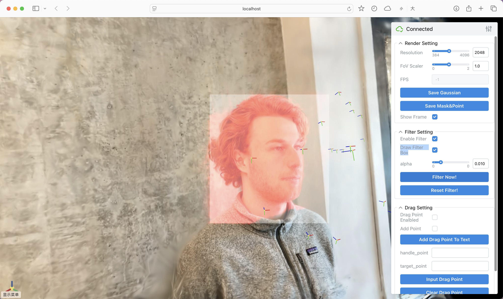
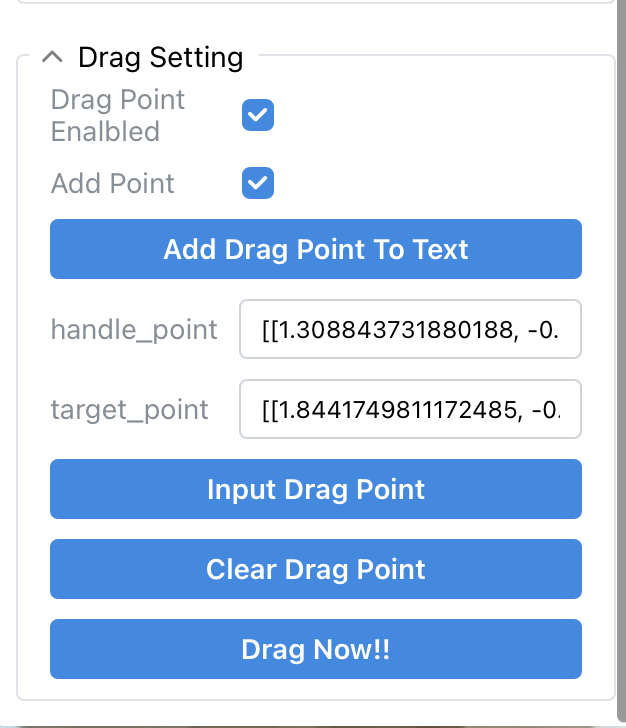
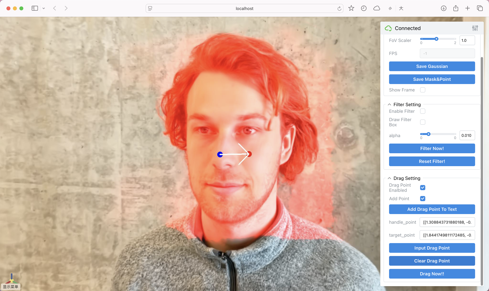

### WebUI Instructions
#### 1. Start WebUI
这里以face场景为例，文件结构为
```
└── data
    └── face
        ├── image
        ├── sparse
        └── point_cloud.ply
```
使用命令启动webui
```
python webui.py --colmap_dir ./data/face/ --gs_source ./data/face/point_cloud.ply --output_dir result
```
之后您可以看到如下画面 \


#### 2. 选择编辑区域
勾选右侧Enable Filter和Draw Filter Box，之后点击画面进行区域选择 \


之后按下Filter Now!确定选择区域，所选区域会被红色高亮表示 \


您也可以切换至其他视角，继续选择编辑区域，我们会对其取交集。另外，通过Reset Filter!可以重置编辑区域。\


#### 3. 选择拖拽控制点和目标点
勾选右侧Drag Point Enalbled和Add Point，之后点击画面选择点，这里我们使用渲染深度图进行反投影以得到3D点 \


之后按下Add Drag Point To Text将选取点加入到文本框中，您可以在文本框中微调选取点的位置，或者继续在画面上选点逐一添加到文本框中 \


最后，按下Input Drag Point将本文框中的内容作为输入，所有的输入点对在画面上用蓝色(控制点)和红色(目标点)来表示 \


#### 4. 训练
选择编辑区域和拖拽点对后，按下Drag Now!开始训练。 \
或者，你可以按下Save Mask&Point进行数据导出，导出路径为output_dir/export/。导出的Mask和Point分别为gaussian_mask.pt和drag_points.json\
然后您可以通过如下命令不使用webui下进行训练。
```
python drag_3d.py --config configs/main.yaml \
                  --colmap_dir ./data/face/ \
                  --gs_source ./data/face/point_cloud.ply \
                  --point_dir ./data/face/export/drag_points.json \
                  --mask_dir ./data/face/export/gaussian_mask.pt \
                  --output_dir result
```
